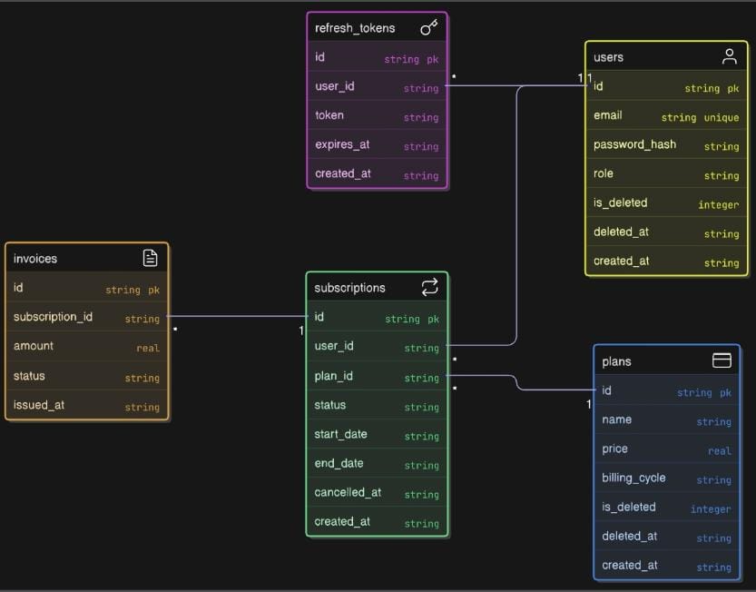

# Subscription & Billing System API

## Overview
This project implements a **Subscription & Billing System** .
It provides secure APIs for user management, subscription plans, subscriptions, and invoices,
with full JWT-based authentication and authorization.

---

##  Tech Stack
- **Runtime:** Node.js
- **Framework:** Express.js
- **Language:** TypeScript
- **Database:** SQLite (better-sqlite3)
- **Authentication:** JWT (Access Token + Refresh Token)
- **Security:** Helmet, CORS, Rate Limiting
- **API Docs:** Swagger (OpenAPI 3.0)
- **Testing:** Postman
---

## Database
- SQLite database (local file)
- Tables: users, plans, subscriptions, invoices, refresh_tokens
- Foreign key relationships enforced

---

---
## Project Structure

 ```text
subscription-and-billing-system/
├── src/
│   ├── controllers/
│   │   ├── auth.controller.ts
│   │   ├── users.controller.ts
│   │   ├── plans.controller.ts
│   │   ├── subscriptions.controller.ts
│   │   └── invoices.controller.ts
│   ├── routes/
│   │   ├── auth.routes.ts
│   │   ├── users.routes.ts
│   │   ├── plans.routes.ts
│   │   ├── subscriptions.routes.ts
│   │   └── invoices.routes.ts
│   ├── services/
│   │   ├── auth.service.ts
│   │   ├── user.service.ts
│   │   ├── plan.service.ts
│   │   ├── subscription.service.ts
│   │   └── invoice.service.ts
│   ├── middlewares/
│   │   ├── authenticate.ts
│   │   ├── authorizeRole.ts
│   │   └── security.ts
│   ├── config/
│   │   ├── env.ts
│   │   └── database.ts
│   ├── swagger/
│   │   └── swagger.ts
│   └── server.ts
├── .env
├── .gitignore
├── package.json
├── tsconfig.json
└── README.md

```
 ## DataBase Schema
  

  ---
  ---

  ## Authentication and Authorization
    - JWT-based authentication
    - Access token required for all routes except register & login
    - Refresh token used to generate new access tokens
    - Role-based authorization (USER, ADMIN)
    - Users can access only their own data
    - Admin-only access for creating subscription plans
    - Soft delete implemented for users

    ---

    ## API Endpoints

    Auth  
    - POST /auth/register  
    - POST /auth/login  
    - POST /auth/refresh-token  
    - POST /auth/logout  

    Users  
    - GET /users/me  
    - PATCH /users/me  
    - PATCH /users/me/password  
    - DELETE /users/me  

    Plans  
    - POST /api/plans (Admin only)  
    - GET /api/plans  

    Subscriptions  
    - POST /api/subscriptions  
    - GET /api/subscriptions/{id}  
    - DELETE /api/subscriptions/{id}  

    Invoices  
    - GET /api/invoices/{invoiceId}  

    ---

   ## API Documentation
    Swagger UI is available at:
    http://localhost:3000/docs

    ---
    